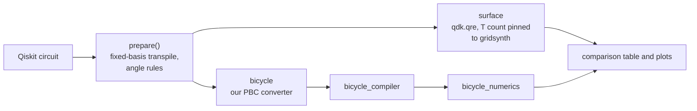
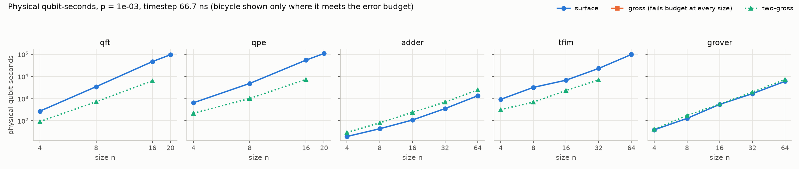

# qre-agent

Working out what a fault-tolerant quantum computer needs to run an algorithm means building the circuit, picking an error-correcting code, and then driving an estimator by hand for each choice. This repo does the estimating part for two architectures, the surface code (Microsoft's QDK estimator) and IBM's bicycle/gross codes (their bicycle compiler), on the same circuits and the same assumptions. An LLM agent on top takes a plain-English problem, writes the circuit and runs both estimators (see Phase 2 below).

## Headline

At physical error rate p = 1e-3, the two-gross bicycle architecture uses fewer physical-qubit-seconds than the surface code on rotation-heavy circuits and more on Toffoli-only ones (surface ÷ two-gross, so above 1 means bicycle wins):

| circuits | surface ÷ two-gross | sizes where two-gross meets the error budget |
|---|---|---|
| QFT, QPE | 2.9 to 7.4x | n = 4 to 16 |
| TFIM | 2.9 to 4.7x | n = 4 to 32 |
| Grover | 0.74 to 0.97x (bicycle 1.05 to 1.35x worse, about break-even) | n = 4 to 64 |
| adder | 0.45 to 0.65x (bicycle 1.5 to 2.2x worse) | n = 4 to 64 |

At the largest rotation-heavy sizes (QFT/QPE n = 20, TFIM n = 64) the ratio would be 8.8x and 3.5x, but two-gross itself exceeds the error budget there, so I don't count them. The plain gross code fails the budget on every circuit at p = 1e-3. At p = 1e-4 the picture flips: against two-gross, the surface code is better by 11 to 200x (see the factory caveat below). The full table is in [results/comparison/table.md](results/comparison/table.md).

## Pipeline



Both sides get the same prepared circuit, the same error budget (1e-3, of which a third goes to rotation synthesis) and the same synthesis precision. Details and every decision are in [docs/](docs/).

## Running it

Setup (Windows, Python 3.11):

```
python -m venv .venv
.venv\Scripts\activate
pip install -r requirements.txt
pip install -e . --no-deps
```

The bicycle compiler is IBM's, and I call it by path without editing it. I used commit `bed7e8a` of [qiskit-community/bicycle-architecture-compiler](https://github.com/qiskit-community/bicycle-architecture-compiler):

```
cargo build --release -F bicycle_compiler/rsgridsynth
```

Then either clone and build it in a `bicycle-compiler/` folder inside this repo (where `assumptions/default.yaml` looks, and it is gitignored) or set the `QRE_COMPILER_DIR` environment variable to its `target/release` folder. Tests that need the compiler are marked `compiler` and are skipped if it isn't found. Don't run the compiler's own `scripts/*.sh`; they rebuild without rsgridsynth. The compiler needs a Clifford lookup table per code, which takes about a minute to generate; it is made on first use and kept in `cache/` (gitignored).

Regenerate everything (table, JSON, both plots):

```
python scripts/compare.py results/comparison/config.yaml
```

That takes about a minute and gives byte-identical output each time. `pytest` runs the tests.

## Results



n = 16, p = 1e-3, timestep 66.7 ns (physical qubit-seconds; qubits and runtime in brackets):

| circuit | surface | two-gross | surface ÷ two-gross |
|---|---|---|---|
| QFT | 4.7e4 (1.59M qubits, 29.6 ms) | 6.4e3 (1,994 qubits, 3,210 ms) | 7.4 |
| QPE | 5.5e4 (1.51M, 36.5 ms) | 7.4e3 (1,994, 3,720 ms) | 7.4 |
| TFIM | 6.8e3 (810k, 8.4 ms) | 2.3e3 (1,994, 1,170 ms) | 2.9 |
| adder | 108 (80.5k, 1.34 ms) | 241 (3,530, 68.4 ms) | 0.45 |
| Grover | 549 (132k, 4.16 ms) | 566 (2,762, 205 ms) | 0.97 |

Bicycle uses 23 to 800x fewer qubits but runs 50 to 140x longer, because it has one T factory and injects T gates one at a time.

## Limitations

- **The timestep length is an assumption.** The paper counts durations in "timesteps" and never gives them in nanoseconds. I use 66.7 ns, picked so that the paper's 6 timesteps per surface-code cycle matches our 400 ns cycle. Runtime is linear in it, so I report where the bicycle advantage disappears (the crossover timestep): 194 to 495 ns for QFT, QPE and TFIM, so those wins hold unless the timestep is about 3x or more longer. For Toffoli-only circuits it is 30 to 44 ns (adder) and 49 to 65 ns (Grover), so bicycle only wins there if its timestep is faster than 66.7 ns. The table also shows 50 and 100 ns.
- **The p = 1e-4 comparison is confounded by factory choice.** The paper uses an 18,600-qubit distillation factory for two-gross at 1e-4, which it calls very conservative, because there are no cultivation estimates at 1e-4. That factory is 67 to 96% of two-gross's qubits there. The surface side uses v3's own factory search. So the 1e-4 rows compare factory choices as much as architectures.
- **A constant in the bicycle numerics disagrees with the paper.** For gross at p = 1e-4, `bicycle_numerics` has a T-injection error 10x higher and a shift error 10x lower than the paper's Table 2. The main results use the code as it is. The sensitivity rows in table.md re-score gross with the paper's values; for QFT8 that turns a budget failure into a pass.
- **QFT and QPE stop at n = 20.** Qiskit's Litinski pass silently treats rotations within 2.4e-6 of a multiple of π/2 as Clifford, so above n = 20 the two estimators would see different circuits. `prepare()` raises an error instead. Going further needs an explicit approximate-QFT rule.
- **Surface is a frontier, bicycle is one point.** For the surface code I take the point on v3's qubits-vs-runtime frontier with the smallest qubit-seconds. The bicycle architecture here has one layout and one factory, so there is nothing to optimise. This favours surface a bit.
- **Both sides use gridsynth T counts.** The surface estimate is pinned to the T count that the compiler's gridsynth needs at the same precision, so the architectures pay the same per-rotation cost. v3's own synthesis model uses far fewer T gates per rotation (about 4x at these precisions). `synthesis: native` switches to that for the surface side; I haven't put native-mode results in the table.
- **Their Qiskit parser has two bugs, so I don't use it.** `scripts/qiskit_parser.py` writes the wrong rotation angle (+t·c instead of −2·t·c; I reported this on upstream issue #26) and puts rotations on the wrong qubits. `src/qre_agent/pbc.py` is my replacement and has tests for both cases.
- **Bicycle runtime numbers vary by about ±1% with the measurement table the compiler generated.** Its table search breaks ties in `HashMap` order, so every generated table differs; qubits, T counts and pass/fail don't change. The sha256 of the tables is recorded with new results (the results above predate that).
- The error totals are sums of per-instruction errors (union bound), so they are conservative. Only tested on Windows.

## Phase 2: the agent

The agent takes a plain-English problem, builds a circuit, estimates it on both architectures and writes an answer, in at most 12 LLM calls. It has five tools: `build_circuit` (Python for a Qiskit circuit, run in a restricted sandbox), `build_benchmark` (qft, qpe, tfim, adder or grover of size n), `estimate_surface`, `estimate_bicycle`, and `verify`. Circuits and results are passed around by id, so the model never re-types them. `verify` is deterministic: it checks that every number in the answer appears in a tool output, for the right architecture. The tools and verifier are in [docs/agent-design.md](docs/agent-design.md).

I ran four models on 40 tasks, 3 passes each (25 standard, 10 free-form where the agent has to write the circuit, 5 ambiguous where it has to state an assumption). A run is correct when the task's checks and the final `verify` both pass. Rates are mean ± standard deviation across the 3 passes, with (min–max). The grader was revised after I read the failures (v2); v1 is shown next to it. Full tables, costs and failure counts are in [results/eval/summary.md](results/eval/summary.md).

| model | correct (v2) | correct (v1) | verify first try (v2) | cost per run | latency p50 | p95 |
|---|---|---|---|---|---|---|
| gemini-2.5-flash | 82% ± 6 (75–87) | 75% ± 4 (70–78) | 93% ± 5 (88–97) | $0.0044 | 9 s | 26 s |
| deepseek-v3.2 | 84% ± 3 (82–88) | 82% ± 4 (78–85) | 86% ± 3 (82–88) | $0.0080 | 68 s | 170 s |
| haiku-4.5 | 81% ± 1 (80–82) | 72% ± 5 (68–78) | 96% ± 1 (95–98) | $0.0290 | 13 s | 26 s |
| sonnet-5 | 97% ± 1 (95–98) | 96% ± 1 (95–98) | 100% ± 0 (100–100) | $0.0464 | 19 s | 66 s |

- **Sonnet is about 15 points ahead** of the others (97% against 81 to 84%), at 1.6 to 10x the cost per run. All models get the standard tasks right (93 to 100%); the gap is in free-form circuits (87% against 43 to 60%).
- **The three cheaper models are within noise of each other under v2** (81 to 84%, spreads of 1 to 6 points). Under v1, DeepSeek is 10 points above Haiku, so that ordering depends on the grader.
- **Verify passes more often than answers are correct.** 53 runs passed `verify` and were still wrong (Gemini 16, Haiku 23, DeepSeek 14), because it checks the answer against the tool outputs, not that the circuit or settings were the right ones. So passing `verify` alone is not enough to decide when to escalate to a stronger model.
- **The eval found three bugs, now fixed.** Gemini rejects numeric enums in tool schemas and called `estimate_bicycle` with no arguments, so the schemas use string enums. `build_circuit` sent code to the sandbox in the Windows code page, so a π in the code crashed it (27 runs rerun after the fix). Rotations at ±π/2 made `estimate_surface` raise on ordinary circuits (rxx, ryy, controlled phases at π, the 4-bit Draper adder); `prepare()` now turns them into Clifford gates.

Limitations:

- **The grader checks numbers, not labels.** "14 physical qubits" for a circuit's 14 logical qubits passes, because 14 is in a tool output.
- **Assumption checks are regexes.** An ambiguous task passes if the answer states the value or says it assumed or defaulted one; it can't judge whether the assumption was sensible.
- **One eval run per model, 3 passes.** The spreads are run-to-run noise over 3 samples, not confidence intervals, and the same seed doesn't reproduce a run.
- **The grader changed after I read the failures.** Its rules came from the same runs they are scored on, which is why v1 is shown. v2 moves some models by up to 9 points (Haiku 72% to 81%) and Sonnet by 1.

## Prior work

- **Microsoft's resource estimator** ([QDK](https://github.com/microsoft/qdk)). I use its new `qdk.qre` module for the surface side. The older `qdk.qiskit.estimate` is deprecated; I only keep it as a cross-check on logical counts. See `docs/qdk-interface.md` for what I found.
- **[DeDuckProject/quantum-resource-estimator-mcp](https://github.com/DeDuckProject/quantum-resource-estimator-mcp)**, an MCP server around Microsoft's estimator with tools like `estimate_resources`, `compare_configurations` and `generate_frontier`. As far as its README shows, it wraps that one estimator. What I add is a second architecture (bicycle) on the same circuits with matched assumptions, which is where most of the work went.
- **Krol et al.** ([arXiv:2408.02587](https://arxiv.org/abs/2408.02587), Appendix D, which is in the PDF but not in the arXiv HTML version). They run one day of an industrial shift-scheduling problem through three estimators at p = 1e-3 and a 1e-3 error budget and get different answers: Bench-Q gives 348,000 physical qubits and 6.2 s; Microsoft's estimator gives 529,000 qubits and 72 ms with Qiskit input but 460,000 qubits and 50 ms with Q# input; Qualtran gives 111,000 qubits and 1.3 s. They put the Qiskit/Q# gap down to how the input is decomposed into T gates. That is why `prepare()` fixes one transpile and gives the identical circuit to both architectures. I don't compare estimators on the same architecture, so I can't say how much of such gaps is the tool and how much is the input.
- **Tour de gross** ([arXiv:2506.03094](https://arxiv.org/abs/2506.03094)) and IBM's compiler. I use their compiler and numerics and their module and factory sizes. Their own surface-code comparison uses a simple formula (2d² qubits per patch); I use v3 for the surface side instead.
